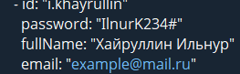
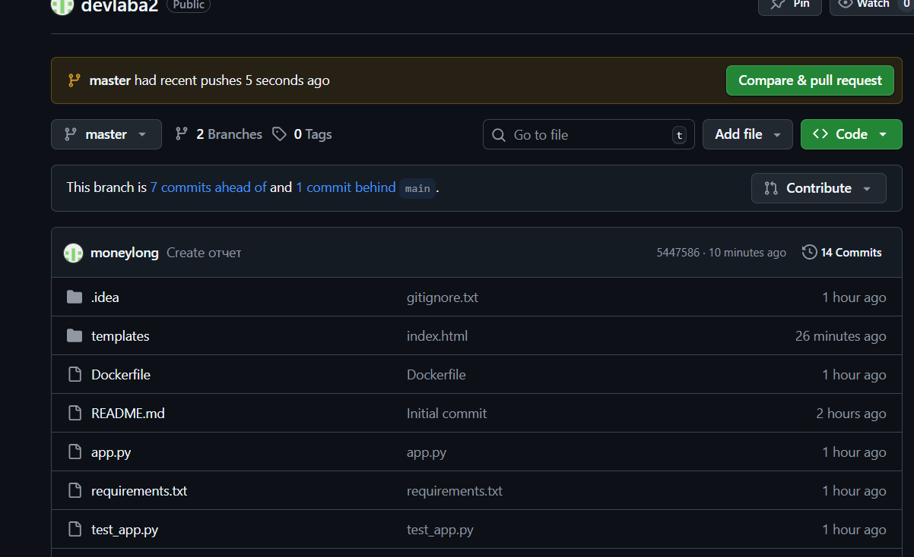
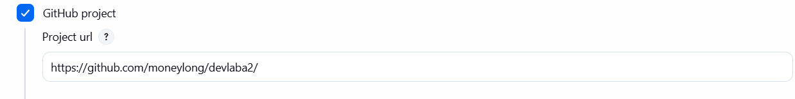
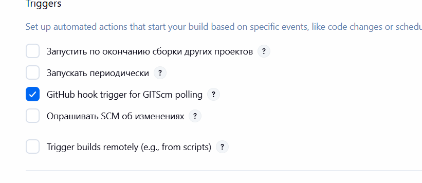
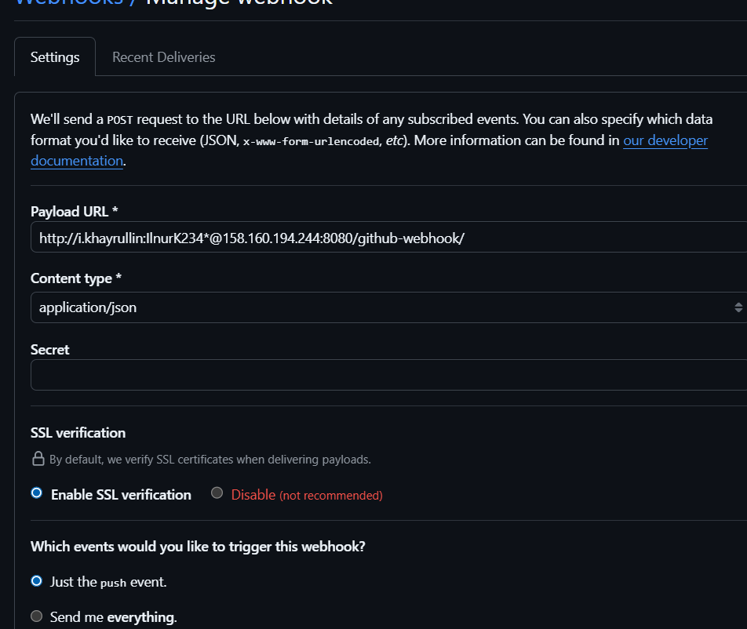
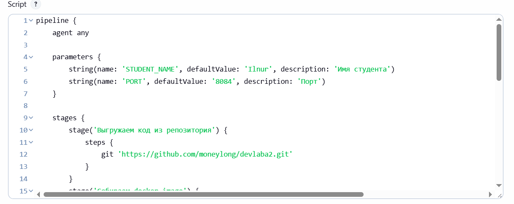

# devlaba2
**Отчет**

1. зашёл в jenkins

2. залогинился

3. создал свой репозиторий и скопировал из методички данные

4. Создал в jenkins новый item зашёл в настройки и соединил его со своим github репозиторием

5. Поставил галочку на авто сбор при изменении в github

6. В github настроил его на адрес для jenkins порта

7. скопировал структуру Jenkinsfile и изменил по себя

8. и запустил 

